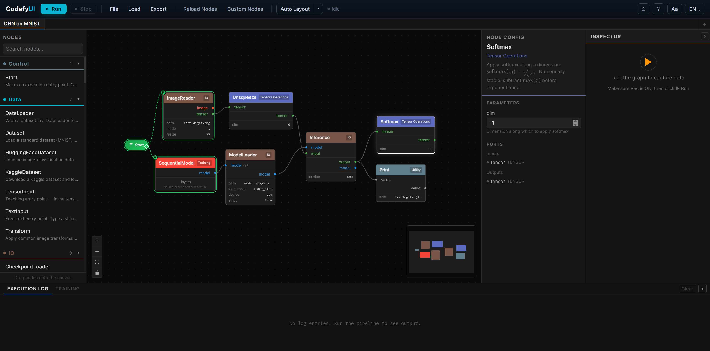

# CodefyUI

[](https://treeleaves30760.github.io/CodefyUI/)
[](https://treeleaves30760.github.io/CodefyUI/zh-TW/)

A visual, node-based deep learning pipeline builder. Design CNN, RNN, Transformer, and RL architectures by dragging nodes onto a canvas, connecting them into a DAG, and executing the pipeline — all from the browser.

📖 **Full documentation: [treeleaves30760.github.io/CodefyUI](https://treeleaves30760.github.io/CodefyUI/)** — installation, usage, and advanced guides (English / 繁體中文).



## Features

- **Visual Graph Editor** — Drag-and-drop nodes, connect ports with type-safe edges, real-time validation
- **94 Built-in Nodes** across 15 categories (CNN, RNN, Transformer, RL, Data, Data Flow, Training, IO, Control, Utility, Normalization, Tensor Operations, LLM, Classical, Diffusion)
- **Teaching Inspector** — Record full per-node outputs, inspect input→output tensor diffs side-by-side, and wrap a subgraph with the **Compare Segment** bubble to focus on just head-input vs tail-output. Drop in a `TensorInput` node with an inline grid editor to feed the pipeline and watch each transformation
- **Preset System** — Pre-built model templates for quick start; export your own subgraphs as reusable presets
- **Multi-Tab Workspace** — Multiple independent canvases, each with its own execution context
- **WebSocket Execution** — Real-time per-node progress, Print node output displayed in the Execution Log panel
- **Partial Re-Execution** — Dirty node tracking: only re-runs changed nodes and their downstream dependencies
- **Quick Node Search** — Double-click the canvas to open an instant search panel for adding nodes and presets
- **Custom Node Manager** — GUI for uploading, enabling/disabling, and deleting custom nodes
- **Model File Management** — Upload, list, and delete model weight files (.pt, .pth, .safetensors, .ckpt, .bin) via REST API
- **CLI Graph Runner** — Execute graph.json directly from the command line with `run_graph.py`
- **Results Panel** — Tabbed panel (Execution Log / Training), resizable, with live loss chart
- **i18n** — English and 繁體中文, with responsive `rem`-based font sizing
- **Persistence** — Auto-saves all tabs to `localStorage`; import/export graph JSON files
- **Dark Theme** — Fully styled dark UI with color-coded categories

## Quick Start

**One-liner install**:

```bash
# macOS / Linux
curl -fsSL https://raw.githubusercontent.com/treeleaves30760/CodefyUI/main/install.sh | bash
```

```powershell
# Windows (PowerShell)
powershell -ExecutionPolicy ByPass -c "irm https://raw.githubusercontent.com/treeleaves30760/CodefyUI/main/install.ps1 | iex"
```

Installs only what's needed to run the app: `git`, `uv`, and Python (via uv). The frontend bundle is downloaded prebuilt from the latest GitHub release, and the backend is **checked out at that same release tag** so the two stay in sync — **no Node.js or pnpm required for end users**. After install, **open a new terminal** and run from anywhere:

```bash
cdui start
```

Open [http://localhost:8000](http://localhost:8000). The single uvicorn process serves both the API and the prebuilt React app. `cdui start` runs in the **background** by default — you can close the terminal and the server keeps running; manage it with `cdui status` and `cdui stop`. Add `--foreground` (`-f`) to run it attached and stop with `Ctrl+C`.

| Command | Description |
|---------|-------------|
| `cdui install` | Install backend deps; download prebuilt frontend (or local build if `pnpm` available) |
| `cdui update` | Update to the latest release (prebuilt path) or pull `main` (when building from source) and re-sync the frontend |
| `cdui start` | Production mode — single uvicorn on `:8000`, in the background (no Node needed). `--foreground`/`-f` runs it attached |
| `cdui status` | btop / k9s-style dashboard: CPU, memory, disk, GPU, top processes, plus the server's PID and health. Refreshes live by default (every 2s, `Ctrl+C` to quit); pass a number to set the interval (`cdui status 1`), or `--once` for a single frame. Piped/non-interactive output is single-frame automatically |
| `cdui dev` | Developer mode — backend `:8000` + Vite HMR `:5173` (requires Node + pnpm) |
| `cdui build` | Build the frontend bundle locally (requires Node + pnpm) |
| `cdui stop` | Stop all services (including the background server) |
| `cdui test` | Run backend tests |
| `cdui clean` | Remove virtualenv, `node_modules`, and `frontend/dist` |
| `cdui uninstall` | Clean + remove the PATH launcher |
| `cdui plugin install <name\|url>` | Install a plugin pack (catalog name like `C2`, `owner/repo[@ref]`, or full GitHub URL) |
| `cdui plugin list` | List installed plugin packs |
| `cdui plugin uninstall <id>` | Remove an installed plugin pack |

> `cdui` is a thin launcher (`cdui.cmd` on Windows) placed at `~/.local/bin/cdui` by the installer. If you didn't restart your terminal yet, invoke the absolute path: `~/CodefyUI/cdui start`. `python scripts/dev.py <cmd>` still works too — `dev.py` re-execs into the venv's Python automatically.

**Contributors:** if you want hot-reload (`cdui dev`), pass `CODEFYUI_FORCE_BUILD=1` to the installer or install Node 24+ and pnpm separately. `CODEFYUI_FORCE_BUILD=1` also tracks the bleeding-edge `main` branch (building the frontend from source so it matches the backend), whereas the default prebuilt path pins to the latest tagged release. Pin a specific release with `CODEFYUI_RELEASE_TAG=<tag>`.

#### `cdui install` flags & environment variables

Both `install.sh`/`install.ps1` and `cdui install` (after first install) accept the same set of choices, either as CLI flags or pre-set environment variables. Defaults are interactive when stdin is a TTY, and the safe choices when not.

| Flag | Env var | Values | Purpose |
|------|---------|--------|---------|
| `--gpu <choice>` | `CODEFYUI_GPU` | `auto` / `cu118` / `cu121` / `cu124` / `cu128` / `rocm6.1` / `rocm6.2` / `cpu` / `mps` / `skip` | Select PyTorch wheel index. `auto` detects via `nvidia-smi` / `rocm-smi` / Apple Silicon. `skip` installs no torch (advanced — for users with a custom torch already in the venv). |
| `--dev` / `--no-dev` | `CODEFYUI_DEV` | `1` / `0` | Install the `[dev]` extra (pytest, httpx, httpx-ws). Required for `cdui test`. Default off for end users, on for contributors. |
| `--yes` | — | — | Accept all defaults non-interactively (CI / headless). |
| `--lang <code>` | `CODEFYUI_LANG` | `en` / `zh-TW` | Localise the installer prompts. |
| — | `CODEFYUI_DIR` | path | Install directory (default: `~/CodefyUI`). |
| — | `CODEFYUI_RELEASE_TAG` | tag | Pin the frontend bundle to a specific release (default: `latest`). |
| — | `CODEFYUI_FORCE_BUILD` | `1` | Skip the prebuilt-dist download and build locally with pnpm. |

> This quick start assumes an **NVIDIA GPU with CUDA 12.4**. For CPU, Apple Silicon, AMD, or detailed troubleshooting, see the [GPU & Device Setup guide](https://treeleaves30760.github.io/CodefyUI/getting-started/gpu-device).

### CLI Execution

Run a graph directly from the command line without starting the server:

```bash
cd backend
python run_graph.py ../examples/Usage_Example/CNN-MNIST/TrainCNN-MNIST/graph.json
python run_graph.py ../examples/Model_Architecture/ResNet-SkipConnection-CNN/graph.json --validate-only
```

## Architecture

```
frontend/   React 19 · TypeScript · React Flow 12 · Zustand 5 · Vite 6
backend/    Python 3.10+ · FastAPI · PyTorch
```

| Principle | Detail |
|-----------|--------|
| **Backend-authoritative** | `GET /api/nodes` returns all node definitions. Adding a backend node auto-appears in the UI. |
| **Single BaseNode component** | One React component renders all node types, parameterized by backend definitions. |
| **WebSocket execution** | `ws://host/ws/execution` streams per-node status. REST handles graph CRUD. |
| **Topological execution** | Kahn's algorithm for DAG sort + cycle detection. Parallel execution of independent nodes. |

## Built-in Nodes

| Category | Nodes | Count |
|----------|-------|-------|
| **CNN** | Conv2d, Conv1d, ConvTranspose2d, MaxPool2d, AvgPool2d, AdaptiveAvgPool2d, BatchNorm2d, Dropout, Activation | 9 |
| **RNN** | LSTM, GRU, RNNCell | 3 |
| **Transformer** | MultiHeadAttention, TransformerEncoder, TransformerDecoder, MoELayer | 4 |
| **RL** | DQN, PPO, EnvWrapper, RewardModel, KLDivergence | 5 |
| **Data** | Dataset, DataLoader, Transform, HuggingFaceDataset, KaggleDataset, TensorInput, TextInput, CSVReader, ColumnSelector, Normalize, SyntheticDataset, TrainTestSplit | 12 |
| **Data Flow** | Map, Reduce, Switch | 3 |
| **Training** | Optimizer, Loss, TrainingLoop, LRScheduler, SequentialModel, BackwardOnce | 6 |
| **IO** | ImageReader, ImageWriter, ImageBatchReader, FileReader, CheckpointSaver, CheckpointLoader, ModelLoader, ModelSaver, Inference | 9 |
| **Control** | Start | 1 |
| **Utility** | Print, Reshape, Concat, Flatten, Linear, Visualize, Embedding | 7 |
| **Normalization** | BatchNorm1d, LayerNorm, GroupNorm, InstanceNorm2d | 4 |
| **Tensor Operations** | Add, MatMul, Mean, Multiply, Permute, Softmax, Split, Squeeze, Stack, TensorCreate, Unsqueeze | 11 |
| **LLM** | Tokenizer, WordVector, EmbeddingScatter, CosineSimilarity, AttentionMask, AttentionHeatmap, PositionalEncoding | 7 |
| **Classical** | KNN, LinearRegression, LogisticRegression, DecisionTreeClassifier, SVMClassifier, MLPClassifier, Accuracy | 7 |
| **Diffusion** | Upsample, TimestepEmbedding, Lerp, GaussianNoise, DDPMSampler, DiffusionUNet | 6 |

## Examples

Pre-built example workflows organized in `examples/`:

| Category | Examples |
|----------|----------|
| **Model Architecture** | ResNet, ConvNeXt, EfficientNet, UNet, ViT, SwinTransformer, BERT, GPT, LLaMA, DiT, LSTM TimeSeries, BiGRU SpeechRecognition, Seq2Seq Attention, DQN Atari, PPO Robotics |
| **Usage Example** | CNN-MNIST Training, CNN-MNIST Inference, GPT-Mini Training, ResNet-CIFAR10 Training |
| **LLM** | Word Embedding Analogy (`king − man + woman ≈ queen` with the offline `demo-16d` backend) |

## Teaching Inspector

CodefyUI can be used as an interactive lesson — students see the exact tensor that flows through every node.

1. Drag a **TensorInput** node onto the canvas (Data category). Set `value_mode: explicit` and fill the inline grid with the numbers you want the pipeline to see.
2. Wire it through any chain of tensor-op nodes (e.g. `Reshape → Softmax → Print`).
3. **Drag a `Start` node onto the canvas and connect its trigger output (the diamond handle on the right side of the Start node) to the first node you want executed — typically the `TensorInput`.** Without a Start → first-node trigger edge the graph is a draft and `Run` will reject it with a *"No start node defined"* toast. Only nodes reachable from a Start are executed.
4. Open the toolbar **Settings** (⚙) popover and switch **Record outputs** ON, then click **Run**. Every completed node's full output is captured in server memory, keyed by the run.
5. Click any node — the right-hand **Inspector** panel fetches that node's input and output, showing shape, dtype, min/max/mean and the actual values stacked top-to-bottom. Cells that changed are heat-coloured.
6. Shift-select two nodes and use **Compare Segment** (also under ⚙ Settings → Inspection) to focus on just the head-input and tail-output; the canvas wraps them in a light-orange bubble with **HEAD** / **TAIL** badges so the scope is obvious.
7. Switch **Record outputs** OFF before a heavy training run if you don't want each epoch captured — previously captured runs stay fetchable until the server restarts.

Captured data is per-session RAM (LRU, last 20 runs). Segment markers are saved with the graph JSON.

### Settings popover toggles

The toolbar **⚙ Settings** popover groups every per-tab teaching/training switch in one place — same idea as VS Code's Settings UI:

| Toggle | What it does |
|--------|---|
| **Record outputs** | Capture each completed node's full output for the Inspector. Off by default for heavy training runs. |
| **Verbose mode** | Backend records intermediate algorithmic steps (attention scores, softmax temperatures, etc.) alongside outputs — feeds the Inspector "Steps" tab. |
| **Compare Segment** | Wraps two shift-selected nodes in a HEAD/TAIL bubble so the Inspector shows only that subgraph's boundaries. |
| **Persist weights between runs** | Keep `Conv2d`/`Linear`/`Attention` weights across Run clicks (so the model actually learns). When off, every run reinitialises. |
| **Reset all weights now** | Drop every cached weight for this tab; next Run starts fresh. |
| **Capture gradients** | Run forward + `.backward()` and store each layer's gradient for the Inspector "Backward" tab. |
| **Auto-synthesize loss** | When the graph has no `Loss`/`BackwardOnce` node, synthesize one so `.backward()` can run. |
| **Grid snap** | Snap dragged nodes to the canvas grid. |
| **Show node tooltips** | Reveal the description card when hovering nodes on the canvas. |
| **Node category mode** | `Basic` shows only essential categories in the sidebar; `All` shows every category. |

## Plugin Packs

Educational ("Edu") nodes ship as installable plugin packs, organised **by
direction** so each maps onto a hands-on textbook module and installs
cumulatively as you progress:

```bash
cdui plugin install foundations deep rl   # full textbook companion
cdui plugin list
cdui plugin info deep                      # manifest, lessons covered, node names
cdui plugin search attention              # query the catalog
cdui plugin install foo/bar               # third-party pack from GitHub
cdui plugin uninstall deep
```

Built-in direction packs live in `plugins/<id>/` inside this repo (activated
in place, no copies). Third-party packs are downloaded as a pinned-SHA
tarball into `<USER_DATA>/plugins/<id>/` and AST-validated before install.
The lockfile at `<USER_DATA>/plugins/installed.json` records every install
and lets `cdui start` rediscover them on the next launch.

| Pack | Hands-on modules | Edu nodes |
|------|------------------|-----------|
| `foundations` | I1 資料表示 · I2 經典 ML | Edu-ColumnStats, Edu-KNN, Edu-LinearRegression, Edu-LogisticRegression, Edu-TokenEmbedding, Edu-FFN |
| `deep` | I3 視覺 · I4 序列 | Edu-CrossAttention, Edu-ResBlock, Edu-SelfAttention, Edu-MultiHeadAttention, Edu-Patchify |
| `rl` | I5 強化學習 | Edu-PolicyGradient |

Each Edu node decomposes a single lesson concept into a chain of named steps
that the Teaching Inspector renders one row at a time — `Edu-ColumnStats`
shows the population-std formula as `sum → divide → deviations² → variance
→ sqrt`; `Edu-PolicyGradient` exposes `softmax → gather → log → baseline →
loss`; `Edu-Patchify` makes `unfold → permute → flatten` visible. Switch
**Verbose mode** in the toolbar ⚙ Settings popover to capture them.

### Writing your own plugin

Fork the [**Official Plugin Template**](https://github.com/treeleaves30760/CodefyUI-Plugin-Official) — a working, MIT-licensed plugin with two example nodes, a sample example graph, a test suite, and a fully-commented manifest. The README there walks you through every field and the AST security gate.

```bash
# Install the template itself to see the pattern live
cdui plugin install treeleaves30760/CodefyUI-Plugin-Official

# After forking
cdui plugin install your-username/your-fork
```

> **BREAKING (v0.3):** the chapter packs `c1`–`c6` are repackaged into three
> direction packs `foundations` / `deep` / `rl`, and every Edu node's type id
> gains a dash (`EduKNN` → `Edu-KNN`). Saved graphs that reference the old
> `cN:EduFoo` types must be updated to `<pack>:Edu-Foo` and the packs
> reinstalled with `cdui plugin install foundations deep rl`.

## Custom Nodes

Drop a `.py` file in `backend/app/custom_nodes/` extending `BaseNode`:

```python
from app.core.node_base import BaseNode, DataType, PortDefinition

class MyNode(BaseNode):
    NODE_NAME = "MyNode"
    CATEGORY = "Custom"
    DESCRIPTION = "Does something"

    @classmethod
    def define_inputs(cls):
        return [PortDefinition(name="input", data_type=DataType.TENSOR)]

    @classmethod
    def define_outputs(cls):
        return [PortDefinition(name="output", data_type=DataType.TENSOR)]

    def execute(self, inputs, params):
        return {"output": inputs["input"]}
```

Hot-reload via `POST /api/nodes/reload` or the **Reload Nodes** button in the toolbar. Or use the **Custom Node Manager** GUI to upload, enable/disable, and delete custom nodes.

## Key Bindings

| Action | Key |
|--------|-----|
| Delete node | `Delete` |
| Multi-select | `Shift` + click |
| Quick add node | Double-click canvas |
| Rename node | Right-click → Rename |
| Duplicate node | Right-click → Duplicate |
| Undo | `Ctrl/Cmd` + `Z` |
| Redo | `Ctrl/Cmd` + `Shift` + `Z` / `Ctrl/Cmd` + `Y` |
| Copy nodes | `Ctrl/Cmd` + `C` |
| Paste nodes | `Ctrl/Cmd` + `V` |
| Auto Layout | `Shift` + `L` |
| Show shortcuts | `?` |

## API Endpoints

| Endpoint | Method | Description |
|----------|--------|-------------|
| `/api/health` | GET | Health probe — returns `nodes_loaded`, `presets_loaded` |
| `/api/nodes` | GET | List all node definitions |
| `/api/nodes/{node_name}` | GET | Get a single node definition |
| `/api/nodes/reload` | POST | Hot-reload all built-in and custom nodes |
| `/api/presets` | GET | List preset definitions |
| `/api/presets/{name}` | GET | Get a single preset definition |
| `/api/presets/create` | POST | Create a new preset from selected nodes |
| `/api/graph/validate` | POST | Validate a graph |
| `/api/graph/save` | POST | Save a graph |
| `/api/graph/load/{name}` | GET | Load a saved graph |
| `/api/graph/list` | GET | List saved graphs |
| `/api/graph/export` | POST | Export graph as Python script |
| `/api/examples/list` | GET | List example graphs |
| `/api/examples/load` | GET | Load an example graph |
| `/api/custom-nodes` | GET | List custom nodes |
| `/api/custom-nodes/upload` | POST | Upload a custom node |
| `/api/custom-nodes/toggle` | POST | Enable/disable a custom node |
| `/api/custom-nodes/{filename}` | DELETE | Delete a custom node |
| `/api/plugins` | GET | List installed plugin packs |
| `/api/plugins/{id}` | GET | Get a plugin's manifest + README |
| `/api/plugins/reload` | POST | Hot-reload all node and preset sources |
| `/api/models` | GET | List uploaded model files |
| `/api/models/upload` | POST | Upload a model weight file |
| `/api/models/download/{filename}` | GET | Download a model weight file (supports nested paths) |
| `/api/models/{filename}` | DELETE | Delete a model file |
| `/api/images` | GET | List uploaded image files |
| `/api/images/upload` | POST | Upload an image file |
| `/api/images/download/{filename}` | GET | Download an image file |
| `/api/images/{filename}` | DELETE | Delete an image file |
| `/api/execution/outputs/{run_id}` | GET | List ports captured for a run |
| `/api/execution/outputs/{run_id}` | DELETE | Clear a captured run |
| `/api/execution/outputs/{run_id}/{node_id}/{port}` | GET | Fetch a captured tensor (supports `?slice=0,:,:`) |
| `/api/execution/outputs/{run_id}/{node_id}/__steps_index` | GET | Step-trace metadata for a node (Inspector → Steps tab) |
| `/api/execution/outputs/{run_id}/{node_id}/__grad_index` | GET | Captured gradient metadata (Inspector → Backward tab) |
| `/api/execution/state/reset` | POST | Reset persisted layer weights (per-node or per-graph) |
| `/api/execution/state/list` | GET | List how many modules are persisted (diagnostic) |
| `/ws/execution` | WebSocket | Real-time graph execution (accepts `run_id`, `record_outputs`) |

## Tests

```bash
cd backend
source .venv/bin/activate
pytest tests/ -v
```

## License

CodefyUI uses a dual path licensing model:

- **Open source path**: AGPL-3.0-only for individual developers, small teams, education, research, community use, and any other use case that can comply with AGPL-3.0.
- **Commercial path**: proprietary, closed-source, SaaS, OEM, enterprise, or other use cases that need terms outside AGPL-3.0 should contact the maintainers for a commercial license.

Commercial licensing contact: https://github.com/treeleaves30760/CodefyUI/issues
