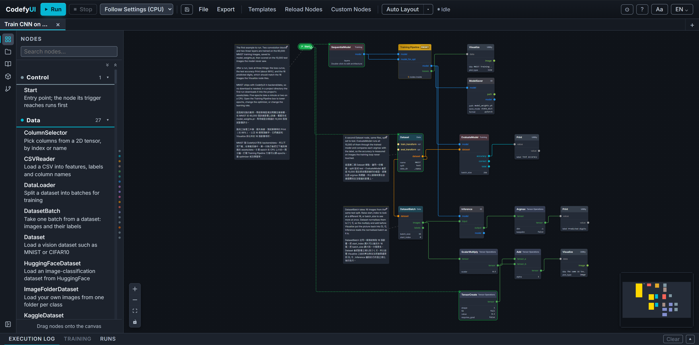

# CodefyUI

[](https://docs.codefyui.com/)
[](https://docs.codefyui.com/zh-TW/)

A visual, node-based deep learning pipeline builder. Design CNN, RNN, Transformer, and RL architectures by dragging nodes onto a canvas, connecting them into a DAG, and executing the pipeline — all from the browser.

**Full documentation: [docs.codefyui.com](https://docs.codefyui.com/)** — installation, usage, and advanced guides (English / 繁體中文).



## Features

- **Visual Graph Editor** — Drag-and-drop nodes, connect ports with type-safe edges, real-time validation
- **152 Built-in Nodes** across 16 categories (CNN, RNN, Transformer, RL, Data, Data Flow, Training, IO, Control, Utility, Normalization, Tensor Operations, LLM, Classical, Diffusion, VLA)
- **Teaching Inspector** — Record full per-node outputs, inspect input→output tensor diffs side-by-side, and wrap a subgraph with the **Compare Segment** bubble to focus on just head-input vs tail-output. Drop in a `TensorInput` node with an inline grid editor to feed the pipeline and watch each transformation
- **Preset System** — Pre-built model templates for quick start; export your own subgraphs as reusable presets
- **Multi-Tab Workspace** — Multiple independent canvases, each with its own execution context
- **WebSocket Execution** — Real-time per-node progress, Print node output displayed in the Execution Log panel
- **Partial Re-Execution** — Dirty node tracking: only re-runs changed nodes and their downstream dependencies
- **Quick Node Search** — Double-click the canvas to open an instant search panel for adding nodes and presets
- **Custom Node Manager** — GUI for uploading, enabling/disabling, and deleting custom nodes
- **Plugin Center** — Install teaching packs and GitHub plugins from the sidebar's **Custom & Plugins** tab or **Settings**; new nodes appear without a reload
- **Model File Management** — Upload, list, and delete model weight files (.pt, .pth, .safetensors, .ckpt, .bin) via REST API
- **CLI Graph Runner** — Execute graph.json directly from the command line with `run_graph.py`
- **Results Panel** — Tabbed panel (Execution Log / Training / Runs), resizable and collapsible, with live loss chart
- **i18n** — English and 繁體中文, with responsive `rem`-based font sizing
- **Persistence** — Auto-saves all tabs in the browser (IndexedDB, with a `localStorage` fallback); import/export graph JSON files
- **Dark Theme** — Fully styled dark UI with color-coded categories

## Quick Start

**One-liner install**:

```bash
# macOS / Linux
curl -fsSL https://raw.githubusercontent.com/CodefyUI/CodefyUI/main/install.sh | bash
```

```powershell
# Windows (PowerShell)
powershell -ExecutionPolicy ByPass -c "irm https://raw.githubusercontent.com/CodefyUI/CodefyUI/main/install.ps1 | iex"
```

Installs only what's needed to run the app: `git`, `uv`, and Python (via uv). The frontend bundle is downloaded prebuilt from the latest GitHub release, and the backend is **checked out at that same release tag** so the two stay in sync — **no Node.js or pnpm required for end users**. After install, **open a new terminal** and run from anywhere:

```bash
cdui start
```

Open [http://localhost:8000](http://localhost:8000). The single uvicorn process serves both the API and the prebuilt React app. `cdui start` runs in the **background** by default — you can close the terminal and the server keeps running; manage it with `cdui status` and `cdui stop`. Add `--foreground` (`-f`) to run it attached and stop with `Ctrl+C`.

| Command | Description |
|---------|-------------|
| `cdui install` | Install backend deps; download prebuilt frontend (or local build if `pnpm` available) |
| `cdui update` | Update to the latest release (prebuilt path) or pull `main` (when building from source) and re-sync the frontend. Never prompts — reuses the PyTorch variant and dev tooling already in the venv unless `--gpu` / `--dev` override. Refuses while a server is running — `cdui stop` first |
| `cdui start` | Production mode — single uvicorn on `:8000`, in the background (no Node needed). `--foreground`/`-f` runs it attached |
| `cdui status` | btop / k9s-style dashboard: CPU, memory, disk, GPU, top processes, plus the server's PID and health. Refreshes live by default (every 2s, `Ctrl+C` to quit); pass a number to set the interval (`cdui status 1`), or `--once` for a single frame. Piped/non-interactive output is single-frame automatically |
| `cdui dev` | Developer mode — backend `:8000` + Vite HMR `:5173` (requires Node + pnpm) |
| `cdui build` | Build the frontend bundle locally (requires Node + pnpm) |
| `cdui stop` | Stop **this install's** services: the background server, plus leftovers started from this directory (foreground `cdui start`, `cdui dev`'s Vite). `--all` stops every CodefyUI and Vite process on the machine instead — including other people's, so avoid it on a shared host |
| `cdui test` | Run the backend (`pytest`) and frontend (`vitest`) tests; the frontend half is skipped, not failed, when pnpm is absent |
| `cdui clean` | Remove virtualenv, `node_modules`, and `frontend/dist` |
| `cdui uninstall` | Clean + remove the PATH launcher |
| `cdui plugin install <name\|url>` | Install a plugin pack (catalog name like `foundations`, `owner/repo[@ref]`, or full GitHub URL) |
| `cdui plugin list` | List installed plugin packs |
| `cdui plugin uninstall <id>` | Remove an installed plugin pack |

Not shown: `cdui run` (below), the `cdui packs`, `cdui cache` and `cdui project` groups, and the rest of `cdui plugin` — see [CLI Commands](https://docs.codefyui.com/getting-started/cli-commands).

> `cdui` is a thin launcher (`cdui.cmd` on Windows) placed at `~/.local/bin/cdui` by the installer. If you didn't restart your terminal yet, invoke the absolute path: `~/CodefyUI/cdui start`. `python scripts/dev.py <cmd>` still works too — `dev.py` re-execs into the venv's Python automatically.

**Contributors:** if you want hot-reload (`cdui dev`), pass `CODEFYUI_FORCE_BUILD=1` to the installer or install Node 24+ and pnpm separately. `CODEFYUI_FORCE_BUILD=1` also tracks the bleeding-edge `main` branch (building the frontend from source so it matches the backend), whereas the default prebuilt path pins to the latest tagged release. Pin a specific release with `CODEFYUI_RELEASE_TAG=<tag>`.

#### `cdui install` flags & environment variables

`install.sh` / `install.ps1` read only the environment variables below and always run `cdui install --yes`. Run `cdui install` again afterwards for the interactive menu (offered when stdin is a TTY and no flag or env var decides), or pass the flags directly.

| Flag | Env var | Values | Purpose |
|------|---------|--------|---------|
| `--gpu <choice>` | `CODEFYUI_GPU` | `auto` / `cu118` / `cu121` / `cu124` / `cu126` / `cu128` / `rocm6.1` / `rocm6.2` / `cpu` / `mps` / `skip` | Select PyTorch wheel index. `auto` detects via `nvidia-smi` / `rocm-smi` / Apple Silicon. `skip` installs no torch (advanced — for users with a custom torch already in the venv). |
| `--dev` / `--no-dev` | `CODEFYUI_DEV` | `1` / `0` | Install the `[dev]` extra (pytest, httpx, httpx-ws). Required for `cdui test`. Default off for end users, on for contributors. |
| `--yes` | — | — | Accept all defaults non-interactively (CI / headless). |
| `--lang <code>` | `CODEFYUI_LANG` | `en` / `zh` (the env var also accepts `zh-TW`) | The flag localises the `cdui install` / `cdui update` run it is passed to; the env var sets the language of every `cdui` command. |
| — | `CODEFYUI_DIR` | path | Install directory (default: `~/CodefyUI`). |
| — | `CODEFYUI_RELEASE_TAG` | tag | Pin the frontend bundle and the backend checkout to a specific release (default: `latest`). |
| — | `CODEFYUI_FORCE_BUILD` | `1` | Skip the prebuilt-dist download and build locally with pnpm. |

> No GPU flag is needed: the installer auto-detects the GPU (`auto` picks a CUDA wheel from your NVIDIA driver, MPS on Apple Silicon, ROCm when `rocm-smi` is present, CPU otherwise), and the default build works on every platform. For a specific build or troubleshooting, see the [GPU & Device Setup guide](https://docs.codefyui.com/getting-started/gpu-device).
>
> Switching build later needs no terminal: on a server started with `cdui start`, the **GPU PyTorch** card in the Package Center installs the matching wheel and restarts the server for you, keeping the `cdui install --gpu` line on the card for when you would rather run it yourself. See [Installs that restart the server](https://docs.codefyui.com/usage/optional-packs#installs-that-restart-the-server).

### CLI Execution

Submit a graph to the running server's queue — the run survives your terminal and shows up in the Runs panel:

```bash
cdui run examples/Usage_Example/CNN-MNIST/TrainCNN-MNIST/graph.json
```

Or run one directly, without the server:

```bash
cd backend
python run_graph.py ../examples/Usage_Example/CNN-MNIST/TrainCNN-MNIST/graph.json
python run_graph.py ../examples/Model_Architecture/ResNet-SkipConnection-CNN/graph.json --validate-only
```

Flags and exit codes: [Run Queue](https://docs.codefyui.com/usage/run-queue#cdui-run) and [CLI Commands](https://docs.codefyui.com/getting-started/cli-commands).

## Architecture

```
frontend/   React 19 · TypeScript · React Flow 12 · Zustand 5 · Vite 6
backend/    Python 3.10+ · FastAPI · PyTorch
```

| Principle | Detail |
|-----------|--------|
| **Backend-authoritative** | `GET /api/nodes` returns all node definitions. Adding a backend node auto-appears in the UI. |
| **Single BaseNode component** | One React component renders all node types, parameterized by backend definitions. |
| **WebSocket execution** | `ws://host/ws/execution` streams per-node status. REST handles graph CRUD. |
| **Topological execution** | Kahn's algorithm for DAG sort + cycle detection. Parallel execution of independent nodes. |

## Built-in Nodes

| Category | Nodes | Count |
|----------|-------|-------|
| **CNN** | Conv2d, Conv1d, Conv2dExplicit, ConvTranspose2d, MaxPool2d, AvgPool2d, AdaptiveAvgPool2d, BatchNorm2d, Dropout, Activation | 10 |
| **RNN** | LSTM, GRU, RNNCell | 3 |
| **Transformer** | MultiHeadAttention, TransformerEncoder, TransformerDecoder, MoELayer | 4 |
| **RL** | DQN, PPO, EnvWrapper, RewardModel, KLDivergence, PolicyRollout, PPOClipObjective, GroupRelativeAdvantage, Discount, GridWorldEnv, PreferenceDataset, BradleyTerryLoss, BradleyTerryTrain | 13 |
| **Data** | Dataset, ImageFolderDataset, DataLoader, DatasetBatch, Transform, HuggingFaceDataset, KaggleDataset, TensorInput, TextInput, CSVReader, ColumnSelector, RowSelector, Normalize, SyntheticDataset, SyntheticShapes, SyntheticSegmentation, SyntheticSequence, TrainTestSplit, ResizeTransform, ToTensorTransform, NormalizeTransform, RandomCrop, RandomHorizontalFlip, RandomRotation, ColorJitter, RandAugment, ComposeTransform | 27 |
| **Data Flow** | Map, Reduce, Switch | 3 |
| **Training** | Optimizer, Loss, TrainingLoop, EvaluateModel, LRScheduler, SequentialModel, BackwardOnce | 7 |
| **IO** | ImageReader, ImageWriter, ImageBatchReader, FileReader, CheckpointSaver, CheckpointLoader, ModelLoader, ModelSaver, Inference, GraphInput, GraphOutput, VideoLoad, VideoWrite | 13 |
| **Control** | Start | 1 |
| **Utility** | Print, Reshape, Concat, Flatten, Linear, Visualize, Embedding, PythonScript, ScatterPlot2D, DecisionBoundary | 10 |
| **Normalization** | BatchNorm1d, LayerNorm, GroupNorm, InstanceNorm2d | 4 |
| **Tensor Operations** | Add, MatMul, Mean, Multiply, ScalarMultiply, Permute, Softmax, Argmax, Split, Squeeze, Stack, TensorCreate, Unsqueeze, MaskedFill | 14 |
| **LLM** | LLMChat, Tokenizer, WordVector, TextEmbedding, EmbeddingScatter, CosineSimilarity, AttentionMask, AttentionHeatmap, PositionalEncoding, CausalLMModel, LMCrossEntropyLoss, LMTokenizer, TextCorpusDataset, LMTokenizedDataset, DataMixDataset, PerplexityEvaluate, TextGenerate, DocumentLoader, TextChunker, VectorStore, Retriever, PromptBuilder, HFTextGenerate | 23 |
| **Classical** | KNN, LinearRegression, LogisticRegression, DecisionTreeClassifier, RandomForestClassifier, SVMClassifier, MLPClassifier, Accuracy | 8 |
| **Diffusion** | Upsample, TimestepEmbedding, Lerp, GaussianNoise, DDPMSampler, DiffusionUNet, DiffusionTrainingLoop | 7 |
| **VLA** | VLAModel, VLARollout, VLAActionEval, PushWorldEnv, PushWorldDemos | 5 |

## Examples

Pre-built example workflows organized in `examples/`:

| Category | Examples |
|----------|----------|
| **Model Architecture** | ResNet, ConvNeXt, EfficientNet, UNet, ViT, SwinTransformer, BERT, GPT, LLaMA, DiT, LSTM TimeSeries, BiGRU SpeechRecognition, Seq2Seq Attention, DQN Atari, PPO Robotics |
| **Usage Example** | CNN-MNIST Training, CNN-MNIST Inference, GPT-Mini Training, ResNet-CIFAR10 Training, [ResNet-18 / CIFAR-10 Baseline](examples/Usage_Example/ResNet18-CIFAR10-Baseline/) (measured 95.48%, bitwise reproducible), Api-Function (graph-as-a-function demo) |
| **LLM** | Word Embedding Analogy (`king − man + woman ≈ queen` with the offline `demo-16d` backend), Sentence Similarity (zh-TW), Train a Causal LM on TinyStories, RAG fully local, RAG with a chat API |
| **Classical** | Iris with sklearn KNN, Tabular Iris Pipeline |
| **Diffusion** | Forward Process, Toy Sampling, Mini U-Net (Compact) |
| **RL** | RLHF building blocks: reward + KL |
| **RNN** | RNN One Step |
| **Transformer** | Mixture of Experts: top-k routing |
| **VLA** | [Train a VLA on PushWorld](examples/VLA/TrainVLA-PushWorld/) (CUDA GPU, about an hour) |

Requirements and descriptions for each: [Examples Gallery](https://docs.codefyui.com/usage/examples-gallery).

## Teaching Inspector

CodefyUI can be used as an interactive lesson — students see the exact tensor that flows through every node.

1. Drag a **TensorInput** node onto the canvas (Data category). Set `value_mode: explicit` and fill the inline grid with the numbers you want the pipeline to see.
2. Wire it through any chain of tensor-op nodes (e.g. `Reshape → Softmax → Print`).
3. **Drag a `Start` node onto the canvas and connect its trigger output (the diamond handle on the right side of the Start node) to the first node you want executed — typically the `TensorInput`.** Without a Start → first-node trigger edge the graph is a draft and `Run` rejects it with an error toast: *"No entry points defined. Drag a Start node from the palette and connect it to the node you want to start execution from."* The executable set includes each triggered node, its downstream data flow, any upstream nodes that feed data into that set, and internal roots in any reached preset or subgraph container.
4. **Record node outputs** is on by default — check it is still on under **Settings → Recording & Inspection**, then click **Run**. Every completed node's full output is captured in server memory, keyed by the run.
5. Click any node — the right-hand **Inspector** panel fetches that node's input and output, showing shape, dtype, min/max/mean and the actual values stacked top-to-bottom. Cells that changed are heat-coloured.
6. Shift-select two nodes and use **Compare segment** (also under Settings → Recording & Inspection) to focus on just the head-input and tail-output; the canvas wraps them in a light-orange bubble with **HEAD** / **TAIL** badges so the scope is obvious.
7. Switch **Record node outputs** OFF before a heavy training run if you don't want each epoch captured — earlier captures remain fetchable until their whole run is evicted, deleted, or the server restarts.

Captured data lives in server-wide process memory, not browser-session memory. The store keeps at most 20 runs and, by default, 2 GiB; reaching either limit evicts whole oldest runs. Deleting a run or its captured outputs removes that run's captures, and restarting the server clears the store. Segment markers are saved with the graph JSON.

### Settings popover toggles

The toolbar **Settings** popover groups every per-tab switch by section — same idea as VS Code's Settings UI:

| Section | Rows |
|---------|------|
| **Execution** | **Compute device** — CPU by default; nodes set to `auto` follow it. |
| **LLM Providers** | **ChatGPT Codex account** — Sign in / Sign out / Refresh for the Codex provider in `LLMChat`. |
| **Optional packs** | **Package Center** — Open; shows how many packs are installed. |
| **Plugins** | **Plugin Center** — Open; shows how many plugins are installed and available. |
| **Recording & Inspection** | **Record node outputs** (on by default; turn it off before a heavy training run), **Verbose internals** (algorithm internals such as attention scores, for the Inspector's Steps tab), **Compare segment** (Create segment with two nodes selected / Clear active). |
| **Training Behavior** | **Persist weights between runs** (on by default — off means every run reinitialises), **Reset all weights now**, **Capture gradients** (forward + `.backward()`, for the Inspector's Backward tab), **Auto-synthesize loss** (when the graph has no `Loss` / `BackwardOnce` node), **Random seed**, **Deterministic algorithms**. |
| **Editor** | **Grid snap**, **Show node tooltips**, **Node category mode** (Basic / All), **Connection style** (Circuit, the default / Curve). |
| **This Server** | Version, nodes and presets loaded, and cache memory usage, with a Refresh button. |

## Plugin Packs

Educational ("Edu") nodes ship as installable plugin packs, organised **by
direction** so each maps onto a hands-on textbook module and installs
cumulatively as you progress. They also install from inside the editor: the
**Plugin Center** (sidebar **Custom & Plugins** tab → **Plugin Center...**, or
**Settings → Plugins**) takes a catalog name, `owner/repo[@ref]` or a GitHub
URL and loads the new nodes without a reload — see
[Plugin Center](https://docs.codefyui.com/advanced/plugins#plugin-center). From
a terminal:

```bash
cdui plugin install foundations deep rl   # full textbook companion
cdui plugin install edu stats             # hands-on labs + descriptive statistics
cdui plugin list
cdui plugin info deep                      # manifest, lessons covered, node names
cdui plugin search attention              # query the catalog
cdui plugin install foo/bar               # third-party pack from GitHub
cdui plugin uninstall deep
```

Built-in direction packs live in `plugins/<id>/` inside this repo (activated
in place, no copies). Third-party packs are downloaded as a pinned-SHA
tarball into `<USER_DATA>/plugins/<id>/` and AST-validated before install.
The lockfile at `<USER_DATA>/plugins/installed.json` records every install
and lets `cdui start` rediscover them on the next launch.

| Pack | Hands-on modules | Edu nodes |
|------|------------------|-----------|
| `foundations` | I1 資料表示 · I2 經典 ML | Edu-ColumnStats, Edu-KNN, Edu-LinearRegression, Edu-LogisticRegression, Edu-TokenEmbedding, Edu-FFN |
| `deep` | I3 視覺 · I4 序列 | Edu-CrossAttention, Edu-ResBlock, Edu-SelfAttention, Edu-MultiHeadAttention, Edu-Patchify |
| `rl` | I5 強化學習 | Edu-PolicyGradient |
| `edu` | I1 資料表示 · I2 經典 ML（動手做版） | FilterRows, SlidingWindow2D, SentenceEmbedding, Classifier, AdvancedClassifier, FFNLayer, ActivationLayer, TrainAndEvaluate |
| `stats` | — 任何資料集 | Stats-Describe, Stats-GroupByAggregate, Stats-Histogram, Stats-Percentile, Stats-Correlation, Stats-ConfusionMatrix, Stats-TableView, Stats-ChartView |

Each Edu node decomposes a single lesson concept into a chain of named steps
that the Teaching Inspector renders one row at a time — `Edu-ColumnStats`
shows the population-std formula as `sum → divide → deviations² → variance
→ sqrt`; `Edu-PolicyGradient` exposes `softmax → gather → log → baseline →
loss`; `Edu-Patchify` makes `unfold → permute → flatten` visible. Switch on
**Verbose internals** (Settings → Recording & Inspection) to capture them.

### Writing your own plugin

Fork the [**Official Plugin Template**](https://github.com/CodefyUI/CodefyUI-Plugin-Official) — a working, MIT-licensed plugin with two example nodes, a sample example graph, a test suite, and a fully-commented manifest. The README there walks you through every field and the AST security gate.

```bash
# Install the template itself to see the pattern live
cdui plugin install official-template

# After forking
cdui plugin install your-username/your-fork
```

> **BREAKING (v0.3):** the chapter packs `c1`–`c6` are repackaged into three
> direction packs `foundations` / `deep` / `rl`, and every Edu node's type id
> gains a dash (`EduKNN` → `Edu-KNN`). Saved graphs that reference the old
> `cN:EduFoo` types must be updated to `<pack>:Edu-Foo` and the packs
> reinstalled with `cdui plugin install foundations deep rl`.

## Custom Nodes

Drop a `.py` file in `backend/app/custom_nodes/` extending `BaseNode`:

```python
from app.core.node_base import BaseNode, DataType, PortDefinition

class MyNode(BaseNode):
    NODE_NAME = "MyNode"
    CATEGORY = "Custom"
    DESCRIPTION = "Does something"

    @classmethod
    def define_inputs(cls):
        return [PortDefinition(name="input", data_type=DataType.TENSOR)]

    @classmethod
    def define_outputs(cls):
        return [PortDefinition(name="output", data_type=DataType.TENSOR)]

    def execute(self, inputs, params):
        return {"output": inputs["input"]}
```

Hot-reload via `POST /api/nodes/reload` or the **Reload Nodes** button in the toolbar — both re-discover every node and preset source (custom nodes and plugins are re-imported; built-ins are re-registered). Or use the **Custom Node Manager** GUI to upload, enable/disable, and delete custom nodes.

## Key Bindings

Chords are ignored while typing in an input, textarea or note.

| Action | Key |
|--------|-----|
| Undo / Redo | `Ctrl/Cmd` + `Z` / `Ctrl/Cmd` + `Shift` + `Z` (or `Ctrl/Cmd` + `Y`) |
| Copy / Paste nodes | `Ctrl/Cmd` + `C` / `Ctrl/Cmd` + `V` |
| Delete selected | `Delete` |
| Multi-select / Box-select | `Shift` + click / `Shift` + drag (a plain drag pans) |
| Quick add node | Double-click canvas |
| Open node details | `Enter` (one node selected) or double-click a node |
| Bypass selected node(s) | `Ctrl/Cmd` + `B` (with a bypassable node selected) |
| Collapse / expand sidebar | `Ctrl/Cmd` + `B` (nothing bypassable selected) / `Ctrl/Cmd` + `Shift` + `B` (always) |
| Auto Layout (last-used mode) | `Shift` + `L` |
| Save graph (project mode only) | `Ctrl/Cmd` + `S` |
| Rename / Duplicate node | Right-click → Rename / Duplicate |
| Show shortcuts | `?` |

Full list: [Key Bindings](https://docs.codefyui.com/usage/keybindings).

## API Endpoints

The core routes. Most mutating requests under `/api/` need the `X-CodefyUI-Token` header; published-app routes use their own rules, including API-key-only `POST /api/apps/{slug}/invoke`. Everything else — the run queue, sweeps, published apps and API keys, packs and the Plugin Center, files and media — and the full authentication matrix are in the [API reference](https://docs.codefyui.com/advanced/api-reference).

| Endpoint | Method | Description |
|----------|--------|-------------|
| `/api/health` | GET | Health probe — `status`, `version`, `boot_id`, `nodes_loaded`, `presets_loaded`, `caches` (plus `project` in project mode) |
| `/api/nodes` | GET | List all node definitions |
| `/api/nodes/{node_name}` | GET | Get a single node definition |
| `/api/nodes/reload` | POST | Re-discover every node and preset source (custom nodes and plugins re-imported, built-ins re-registered); same as `/api/plugins/reload`; returns the counts |
| `/api/presets` | GET | List preset definitions (`/{name}` returns one) |
| `/api/presets/create` | POST | Create a preset from nodes + edges |
| `/api/graph/validate` | POST | Validate a graph |
| `/api/graph/save` | POST | Save a graph |
| `/api/graph/load/{name}` | GET | Load a saved graph |
| `/api/graph/list` | GET | List saved graphs |
| `/api/graph/export` | POST | Export a single-file headless Python runner (CodefyUI backend environment required) |
| `/api/examples/list` | GET | List example graphs |
| `/api/examples/load` | GET | Load an example graph |
| `/api/custom-nodes` | GET | List custom nodes (`/upload`, `/toggle` and `DELETE /{filename}` manage them) |
| `/api/plugins` | GET | List installed plugin packs (`/{id}` returns one plugin's manifest + README) |
| `/api/models` | GET | List uploaded model files (`/upload`, `/download/{filename}`, `DELETE /{filename}`) |
| `/api/images` | GET | List uploaded image files (same sub-routes as models) |
| `/api/execution/outputs/{run_id}` | GET | List ports captured for a run (`DELETE` clears it) |
| `/api/execution/outputs/{run_id}/{node_id}/{port}` | GET | Fetch a captured tensor (supports `?slice=0,:,:`) |
| `/ws/execution` | WebSocket | Attach/subscribe view of a run — client actions `execute`, `attach` / `detach`, `cancel`, `clear_cache` (`run_id` goes with `attach` and `cancel`); closing the socket never cancels a run |

## Tests

```bash
cd backend
source .venv/bin/activate
pytest tests/ -v
```

## Contributing

Pull requests are welcome. Contributions are accepted under the [Developer Certificate of Origin 1.1](https://developercertificate.org/) — commit with `git commit -s`.

Read **[CONTRIBUTING.md](CONTRIBUTING.md)** first: it covers the sign-off, how to get a dev environment running, and the PR conventions this repo actually follows.

## License

Copyright (C) 2026 CodefyUI (https://github.com/CodefyUI) and the CodefyUI contributors. See [NOTICE](NOTICE).

CodefyUI uses a dual path licensing model:

- **Open source path**: AGPL-3.0-only for individual developers, small teams, education, research, community use, and any other use case that can comply with AGPL-3.0.
- **Commercial path**: proprietary, closed-source, SaaS, OEM, enterprise, or other use cases that need terms outside AGPL-3.0 should contact the maintainers for a commercial license.

Running the unmodified program — including on an internal company server — is permitted under AGPL-3.0 and needs no purchase. AGPL-3.0 §13's source-offer requirement is conditioned on *modifying* the program. See the [Licensing FAQ](https://docs.codefyui.com/licensing) for the details, including what counts as a modification when you write a custom node or a plugin.

Commercial licensing contact: https://github.com/CodefyUI/CodefyUI/issues
