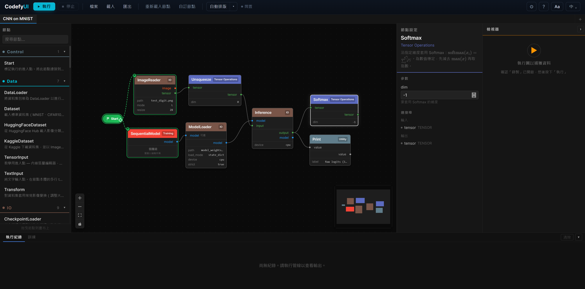

# CodefyUI

[](../README.md)

視覺化、節點式的深度學習管線建構工具。透過拖曳節點到畫布上，連接成 DAG，直接在瀏覽器中設計 CNN、RNN、Transformer 和 RL 架構並執行管線。



## 功能特色

- **視覺化圖形編輯器** — 拖放節點、型別安全的連線、即時驗證
- **69 個內建節點**，涵蓋 13 大類別（CNN、RNN、Transformer、RL、資料、資料流、訓練、IO、控制、工具、正規化、張量運算、LLM）
- **教學檢視器 (Teaching Inspector)** — 記錄每個節點的完整輸出，在右側面板對照輸入與輸出張量的差異；用 **段落比較** 功能以淺橘色泡泡包住一段子圖，只比較 head 的輸入與 tail 的輸出。搭配新的 `TensorInput` 節點（可在網頁直接編輯格子）餵入資料，看資料逐節點變化
- **預設模組系統** — 內建模型模板快速開始；可將子圖匯出為可重用的預設模組
- **多分頁工作區** — 多個獨立畫布，各自擁有獨立的執行環境
- **WebSocket 即時執行** — 即時顯示每個節點的進度，Print 節點的輸出會顯示在執行紀錄面板
- **部分重新執行** — 髒節點追蹤：僅重新執行已變更的節點及其下游依賴
- **快速搜尋節點** — 在畫布上雙擊開啟即時搜尋面板，快速新增節點與預設模組
- **自訂節點管理器** — 上傳、啟用/停用、刪除自訂節點的 GUI 介面
- **模型檔案管理** — 透過 REST API 上傳、列出、刪除模型權重檔（.pt、.pth、.safetensors、.ckpt、.bin）
- **CLI 圖形執行器** — 使用 `run_graph.py` 直接從命令列執行 graph.json
- **結果面板** — 分頁面板（執行紀錄 / 訓練），可調整大小，包含即時 loss 圖表
- **多語言支援** — 英文與繁體中文，使用響應式 `rem` 字型大小
- **自動儲存** — 所有分頁自動存入 `localStorage`；支援匯入/匯出 graph JSON 檔案
- **深色主題** — 完整的深色 UI，類別以顏色區分

## 快速開始

**一行指令安裝**：

```bash
# macOS / Linux
curl -fsSL https://raw.githubusercontent.com/treeleaves30760/CodefyUI/main/install.sh | bash
```

```powershell
# Windows (PowerShell)
powershell -ExecutionPolicy ByPass -c "irm https://raw.githubusercontent.com/treeleaves30760/CodefyUI/main/install.ps1 | iex"
```

只安裝執行需要的東西：`git`、`uv`、Python（由 uv 提供）。前端 bundle 會從 GitHub 的最新 release 直接下載 — **一般使用者完全不需要 Node.js 或 pnpm**。安裝完成後，**請重新開啟 terminal**，然後在任何目錄執行：

```bash
cdui start
```

開啟 [http://localhost:8000](http://localhost:8000)。單一 uvicorn 同時處理 API 與預編好的 React 前端。

| 指令 | 說明 |
|------|------|
| `cdui install` | 安裝 backend；前端從 release 下載（或本地 build，若有 `pnpm`）|
| `cdui update` | 拉取最新 `main` 並重新取得前端 bundle |
| `cdui start` | Production 模式 — 單一 uvicorn 跑 `:8000`（不需 Node）|
| `cdui dev` | 開發模式 — backend `:8000` + Vite HMR `:5173`（需 Node + pnpm）|
| `cdui build` | 本地建置前端 bundle（需 Node + pnpm）|
| `cdui stop` | 停止所有服務 |
| `cdui test` | 執行 backend 測試 |
| `cdui clean` | 移除虛擬環境、node_modules 與 `frontend/dist` |
| `cdui uninstall` | clean + 移除 PATH 上的 launcher |

> `cdui` 是 install 腳本放到 `~/.local/bin/cdui` 的輕量 launcher（Windows 為 `cdui.cmd`）。若你還沒重開 terminal，可改用絕對路徑：`~/CodefyUI/cdui start`。`python scripts/dev.py <cmd>` 也一樣能用——`dev.py` 會自動切換到 venv 的 Python。

**貢獻者：** 若要 HMR（`cdui dev`），可在執行 install 腳本前設 `CODEFYUI_FORCE_BUILD=1`，或自行安裝 Node 24+ 與 pnpm。要鎖定特定版本，可設 `CODEFYUI_RELEASE_TAG=<tag>`。

#### `cdui install` 旗標與環境變數

`install.sh`／`install.ps1` 與後續的 `cdui install` 都接受同一組選項，可以用 CLI 旗標或預先設好的環境變數。stdin 是 TTY 時預設互動，否則走安全預設值。

| 旗標 | 環境變數 | 值 | 用途 |
|------|----------|----|------|
| `--gpu <choice>` | `CODEFYUI_GPU` | `auto`／`cu118`／`cu121`／`cu124`／`cu128`／`rocm6.1`／`rocm6.2`／`cpu`／`mps`／`skip` | 選 PyTorch wheel index。`auto` 透過 `nvidia-smi`／`rocm-smi`／Apple Silicon 自動偵測。`skip` 完全不裝 torch（給自帶 torch 的進階使用者）。|
| `--dev`／`--no-dev` | `CODEFYUI_DEV` | `1`／`0` | 是否安裝 `[dev]` extra（pytest、httpx、httpx-ws）；`cdui test` 需要。一般使用者預設關，貢獻者預設開。|
| `--yes` | — | — | 全部用預設值，不互動（適合 CI／headless）。|
| `--lang <code>` | `CODEFYUI_LANG` | `en`／`zh-TW` | 安裝程式提示文字語言。|
| — | `CODEFYUI_DIR` | 路徑 | 安裝目錄（預設 `~/CodefyUI`）。|
| — | `CODEFYUI_RELEASE_TAG` | tag | 鎖定前端 bundle 為某個 release（預設 `latest`）。|
| — | `CODEFYUI_FORCE_BUILD` | `1` | 跳過下載 prebuilt dist，改本地用 pnpm build。|

> 以上快速開始假設使用 **NVIDIA 顯卡 + CUDA 12.4**。若使用 CPU、Apple Silicon、AMD 或需要更詳細的疑難排解，請參考[完整安裝指南](./SETUP_zh-TW.md)。

### CLI 執行

無需啟動伺服器，直接從命令列執行 graph：

```bash
cd backend
python run_graph.py ../examples/Usage_Example/CNN-MNIST/TrainCNN-MNIST/graph.json
python run_graph.py ../examples/Model_Architecture/ResNet-SkipConnection-CNN/graph.json --validate-only
```

## 架構

```
frontend/   React 19 · TypeScript · React Flow 12 · Zustand 5 · Vite 6
backend/    Python 3.10+ · FastAPI · PyTorch
```

| 原則 | 說明 |
|------|------|
| **後端權威** | `GET /api/nodes` 回傳所有節點定義。後端新增節點後 UI 自動出現。 |
| **單一 BaseNode 元件** | 一個 React 元件渲染所有節點類型，由後端定義參數化。 |
| **WebSocket 執行** | `ws://host/ws/execution` 串流每個節點的狀態。REST 處理圖表 CRUD。 |
| **拓撲排序執行** | 使用 Kahn 演算法進行 DAG 排序 + 循環偵測。支援獨立節點的平行執行。 |

## 內建節點

| 類別 | 節點 | 數量 |
|------|------|------|
| **CNN** | Conv2d、Conv1d、ConvTranspose2d、MaxPool2d、AvgPool2d、AdaptiveAvgPool2d、BatchNorm2d、Dropout、Activation | 9 |
| **RNN** | LSTM、GRU | 2 |
| **Transformer** | MultiHeadAttention、TransformerEncoder、TransformerDecoder | 3 |
| **RL** | DQN、PPO、EnvWrapper | 3 |
| **資料** | Dataset、DataLoader、Transform、HuggingFaceDataset、KaggleDataset、TensorInput、TextInput | 7 |
| **資料流** | Map、Reduce、Switch | 3 |
| **訓練** | Optimizer、Loss、TrainingLoop、LRScheduler、SequentialModel、BackwardOnce | 6 |
| **IO** | ImageReader、ImageWriter、ImageBatchReader、FileReader、CheckpointSaver、CheckpointLoader、ModelLoader、ModelSaver、Inference | 9 |
| **控制** | Start | 1 |
| **工具** | Print、Reshape、Concat、Flatten、Linear、Visualize、Embedding | 7 |
| **正規化** | BatchNorm1d、LayerNorm、GroupNorm、InstanceNorm2d | 4 |
| **張量運算** | Add、MatMul、Mean、Multiply、Permute、Softmax、Split、Squeeze、Stack、TensorCreate、Unsqueeze | 11 |
| **LLM** | Tokenizer、WordVector、EmbeddingScatter、CosineSimilarity | 4 |

## 範例

預建的範例工作流程位於 `examples/`：

| 類別 | 範例 |
|------|------|
| **模型架構** | ResNet、ConvNeXt、EfficientNet、UNet、ViT、SwinTransformer、BERT、GPT、LLaMA、DiT、LSTM TimeSeries、BiGRU SpeechRecognition、Seq2Seq Attention、DQN Atari、PPO Robotics |
| **使用範例** | CNN-MNIST 訓練、CNN-MNIST 推論、GPT-Mini 訓練、ResNet-CIFAR10 訓練 |
| **LLM** | Word Embedding Analogy（用離線的 `demo-16d` backend 計算 `king − man + woman ≈ queen`）|

## 教學檢視器（Teaching Inspector）

CodefyUI 可作為互動式教材 — 讓學生看到資料流過每一個節點的真實張量變化。

1. 把 **TensorInput** 節點（資料類別）拖進畫布。把 `value_mode` 設成 `explicit`，直接在內嵌格子編輯器裡填入想餵給管線的數值。
2. 用任意張量運算節點串起來（例如 `Reshape → Softmax → Print`）。
3. **從節點面板拖一個 `Start` 節點到畫布，把它右邊的 trigger 輸出（菱形 handle）連到你想要開始執行的第一個節點（通常就是 `TensorInput`）。** 少了 Start → 起始節點的 trigger 連線，圖會被當作草稿，按「執行」會出現「尚未定義開始節點」的錯誤提示。只有從 Start 可到達的節點才會被執行。
4. 開啟工具列的 **設定**（⚙）popover 把 **記錄輸出** 切到 ON，然後按 **執行**。每個完成的節點的完整輸出會被保存在伺服器記憶體中，以該次執行的 run id 當作索引。
5. 點任一節點 — 右側 **檢視器** 面板會抓取該節點的輸入與輸出，上下堆疊顯示 shape、dtype、min/max/mean 與實際值。數值變動的格子會以熱力色標示。
6. Shift 選兩個節點 → 按 **段落比較**（同樣在 ⚙ 設定 → 檢視段內），畫布上會以淺橘色泡泡把這段包起來並加上 **HEAD** / **TAIL** 標籤，檢視器切換成只顯示頭部輸入與尾部輸出。
7. 跑重度訓練前想省資源可以先把 **記錄輸出** 切回 OFF — 已經記錄過的 run id 仍然可以查閱，直到伺服器重啟。

被保存的資料是伺服器當下記憶體（LRU，最近 20 次 run）。段落標記會跟著 graph JSON 一起儲存。

### 設定 popover 的開關

工具列的 **⚙ 設定** popover 把每個分頁的教學／訓練開關集中在同一處，概念類似 VS Code 的 Settings UI：

| 開關 | 用途 |
|------|------|
| **記錄輸出 (Record outputs)** | 把每個完成節點的完整輸出存到 Inspector 中。預設關閉以節省資源，跑重度訓練前記得關。 |
| **詳細模式 (Verbose mode)** | 後端把中間算法步驟（attention scores、softmax 溫度等）一起記錄，餵給 Inspector「Steps」分頁。 |
| **段落比較 (Compare Segment)** | 把 shift 選取的兩個節點包成 HEAD/TAIL 泡泡，Inspector 只顯示這個子圖的頭尾。 |
| **跨 run 保留權重** | 跨次 Run 保留 `Conv2d`／`Linear`／`Attention` 權重（讓模型真的學得到東西）；關閉時每次 Run 都會重新初始化。 |
| **立即重置全部權重** | 清掉這個分頁所有快取的權重；下一次 Run 會從頭初始化。 |
| **捕獲梯度 (Capture gradients)** | 跑 forward + `.backward()` 並把每層的梯度存進 Inspector「Backward」分頁。 |
| **自動合成 loss** | 當圖中沒有 `Loss`／`BackwardOnce` 節點時，自動合成一個讓 `.backward()` 跑得起來。 |
| **格線吸附 (Grid snap)** | 拖曳節點時自動吸附到畫布格線。 |
| **顯示節點 tooltip** | 滑鼠停在節點上時顯示描述卡片。 |
| **節點分類模式** | `入門` 只在側欄顯示新手會用到的類別；`全部` 顯示所有類別。 |

## 自訂節點

將 `.py` 檔案放入 `backend/app/custom_nodes/`，繼承 `BaseNode`：

```python
from app.core.node_base import BaseNode, DataType, PortDefinition

class MyNode(BaseNode):
    NODE_NAME = "MyNode"
    CATEGORY = "Custom"
    DESCRIPTION = "自訂節點"

    @classmethod
    def define_inputs(cls):
        return [PortDefinition(name="input", data_type=DataType.TENSOR)]

    @classmethod
    def define_outputs(cls):
        return [PortDefinition(name="output", data_type=DataType.TENSOR)]

    def execute(self, inputs, params):
        return {"output": inputs["input"]}
```

透過 `POST /api/nodes/reload` 或工具列的 **重新載入節點** 按鈕進行熱重載。也可以使用 **自訂節點管理器** GUI 上傳、啟用/停用和刪除自訂節點。

## 快捷鍵

| 操作 | 按鍵 |
|------|------|
| 刪除節點 | `Delete` |
| 多選 | `Shift` + 點擊 |
| 快速新增節點 | 雙擊畫布 |
| 重新命名節點 | 右鍵 → 重新命名 |
| 複製節點 | 右鍵 → 複製 |
| 復原 | `Ctrl/Cmd` + `Z` |
| 重做 | `Ctrl/Cmd` + `Shift` + `Z` / `Ctrl/Cmd` + `Y` |
| 複製節點 | `Ctrl/Cmd` + `C` |
| 貼上節點 | `Ctrl/Cmd` + `V` |
| 自動排版 | `Shift` + `L` |
| 顯示快捷鍵 | `?` |

## API 端點

| 端點 | 方法 | 說明 |
|------|------|------|
| `/api/health` | GET | 健康檢查 — 回傳 `nodes_loaded`、`presets_loaded` |
| `/api/nodes` | GET | 列出所有節點定義 |
| `/api/nodes/{node_name}` | GET | 取得單一節點定義 |
| `/api/nodes/reload` | POST | 熱重載所有內建與自訂節點 |
| `/api/presets` | GET | 列出預設模組定義 |
| `/api/presets/{name}` | GET | 取得單一預設模組定義 |
| `/api/presets/create` | POST | 從選取的節點建立新預設模組 |
| `/api/graph/validate` | POST | 驗證圖形 |
| `/api/graph/save` | POST | 儲存圖形 |
| `/api/graph/load/{name}` | GET | 載入已儲存的圖形 |
| `/api/graph/list` | GET | 列出已儲存的圖形 |
| `/api/graph/export` | POST | 匯出圖形為 Python 腳本 |
| `/api/examples/list` | GET | 列出範例圖形 |
| `/api/examples/load` | GET | 載入範例圖形 |
| `/api/custom-nodes` | GET | 列出自訂節點 |
| `/api/custom-nodes/upload` | POST | 上傳自訂節點 |
| `/api/custom-nodes/toggle` | POST | 啟用/停用自訂節點 |
| `/api/custom-nodes/{filename}` | DELETE | 刪除自訂節點 |
| `/api/models` | GET | 列出已上傳的模型檔案 |
| `/api/models/upload` | POST | 上傳模型權重檔 |
| `/api/models/download/{filename}` | GET | 下載模型權重檔（支援巢狀路徑） |
| `/api/models/{filename}` | DELETE | 刪除模型檔案 |
| `/api/images` | GET | 列出已上傳的影像檔案 |
| `/api/images/upload` | POST | 上傳影像檔案 |
| `/api/images/download/{filename}` | GET | 下載影像檔案 |
| `/api/images/{filename}` | DELETE | 刪除影像檔案 |
| `/api/execution/outputs/{run_id}` | GET | 列出該次 run 捕獲的所有埠口 |
| `/api/execution/outputs/{run_id}` | DELETE | 清除該次 run 的捕獲資料 |
| `/api/execution/outputs/{run_id}/{node_id}/{port}` | GET | 取得該節點某埠口的完整張量（可用 `?slice=0,:,:` 切片） |
| `/api/execution/outputs/{run_id}/{node_id}/__steps_index` | GET | 該節點的步驟追蹤 metadata（Inspector → Steps 分頁） |
| `/api/execution/outputs/{run_id}/{node_id}/__grad_index` | GET | 已捕獲的梯度 metadata（Inspector → Backward 分頁） |
| `/api/execution/state/reset` | POST | 重設保存的權重（單節點或整張圖） |
| `/api/execution/state/list` | GET | 列出已保存的模組數量（診斷用） |
| `/ws/execution` | WebSocket | 即時圖形執行 |

## 測試

```bash
cd backend
source .venv/bin/activate
pytest tests/ -v
```

## 授權

CodefyUI 採用雙軌授權模式：

- **開源路徑**：AGPL-3.0-only，適用於個人開發者、小型團隊、教育、研究、社群使用，以及任何能遵守 AGPL-3.0 條款的使用情境。
- **商業路徑**：若需要閉源、SaaS、OEM、企業部署，或其他不適合 AGPL-3.0 的授權條款，請聯絡維護者取得商業授權。

商業授權聯絡： https://github.com/treeleaves30760/CodefyUI/issues
